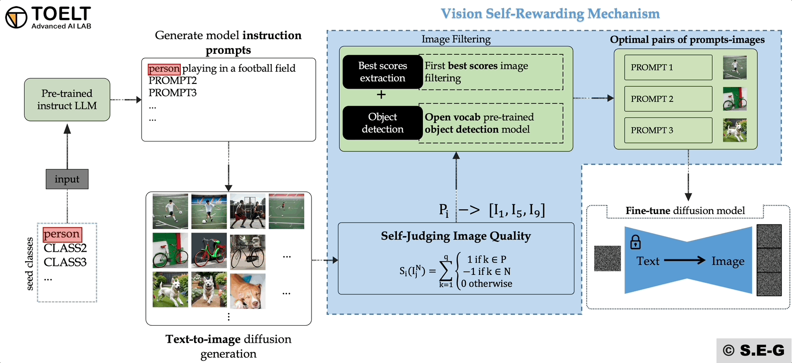

# SREPTTI: Self-Rewarding Pretrained Text-to-Image Models

This repository contain the official implement of the paper **SREPTTI: Self-Rewarding Pretrained Text-to-Image Models**.
You can access the pre-print on [ArXiv](https://arxiv.org/)

*NB: This project is still under development and improvement. The codebase might be subject to regular updates.*

## INTRODUCTION

SREPPTI is a mechanism that allows diffusion models (T2I) to learn from their own generated images and continuously self-improve.
This technique is inspire from this paper: [Self-Rewarding Language Models](https://arxiv.org/abs/2401.10020).

The idea is similar but the method is different. An overall flowchart of the Self-rewarding mechanism is presented in the Gif bellow.



## USAGE INSTRUCTION

###  INSTALLATION
1. Clone the repository and install dependencies using

```bash
git clone https://github.com/safouaneelg/SRT2I.git
```

2. Create a conda environment (optional but recommended) from environment.yml

```bash
conda env create -f environment.yml
conda activate srt2i
```

### USAGE
**Step-by-step self-rewarding**

1. First step is to generate the prompts for generative text-to-image diffusion model. This could be achieved using the following command:

```bash
python llm/prompts_generator.py --model "TheBloke/Mistral-7B-Instruct-v0.2-AWQ" --class_list "llm/class_list.json" --output_prompts "generated_prompts.txt" --prompts_number 30 --class_ids 15,16,17,20,21
```

The default parameters are:
 - `"TheBloke/Mistral-7B-Instruct-v0.2-AWQ"` Mistral 7B quantized
 - `llm/class_list.json` (containing 80 classes from COCO datasets)
 - `generated_prompts.txt` A total of 80*5=400 prompts are generated and stored in this file txt format
 - `prompts_number` The default number of prompts per class is 30 (for the paper we used 100).

Those are the class ids used in the paper: {20:Elephant} and {23:Giraffe}.
In case you generate new prompts for other classes please change with the appropriate ids in [class_list](llm/class_list.json).

2. The subsequent step is the generation of images from prompts, which can be done by using stable diffusion model.
Run the following command to generate the images. The images are stacked by 10

```bash 
python diff_generator/fromprompt_t2i_generation.py --diffusion-model "stabilityai/stable-diffusion-2-1-base" --output-folder "generative_images/" --prompts "generated_prompts.txt"
```

The default parameters are:
 - `"stabilityai/stable-diffusion-2-1-base"` stable diffusion 2.1
 - `generative_images/` folder to store the generated images
 - `generated_prompts.txt` A total of 80*5=400 prompts are generated and stored in this file txt format
 - `prompts_number` The default number of prompts per class is 30

3. To extract the optimal images based on the generated stable diffusion images. You can run the following command:

```bash 
python sr_mechanism/self-reward_dataset_creation.py --image_folder 'path/to/images/folder/' --prompts_file 'path/to/prompts_file.txt' --llava_model 'LLAVA_MODEL' --yolo_model 'YOLO_WORLD_MODEL' 'yolov8x-worldv2.pt' --output_folder './optimal_pairs4/'
```

Parsers:
 - **image_folder**: path to the folder containing stacked 10 images (typically  `generative_images/` in this code)
 - **prompt_file**: path to the `.txt` file containing all the prompt (`generated_prompts.txt`)
 - **llava_model**: name of llava captioning model. Default set to `'llava-hf/llava-1.5-7b-hf'`
 - **yolo_model**: Open Vocabulary YOLO model set by default to `'yolov8x-worldv2.pt'` but can also be changed to `'yolov8m-world.pt'` or `'yolov8s-world.pt'` (check [Ultralytics-docs](https://docs.ultralytics.com/models/yolo-world/#zero-shot-transfer-on-coco-dataset)) 
 - **llm_model**: LLM model for self-judging set by default to `'TheBloke/Mistral-7B-Instruct-v0.2-AWQ'` 
 - **output_folder**: `'path/to/output/storage/folder/'` where optimal images to specific prompts in the **prompt_file** in the will be saved

## Citation
Please if you use our repository cite us as follows :

```
@misc{ghazouali2024sreptti,
      title={SREPTTI: Self-Rewarding Pretrained Text-to-Image Models}, 
      author={Safouane El Ghazouali and Arnaud Gucciardi and Umberto Michelucci},
      year={2024},
      eprint={...},
      archivePrefix={arXiv},
      primaryClass={cs.CV}
}
```

## Licence

This code is open for research and development purposes only. No commercial use of this software is permitted.
For additional information, contact: safouane.elghazouali@toelt.ai.